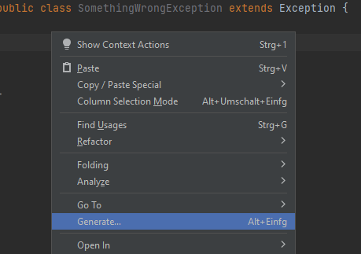
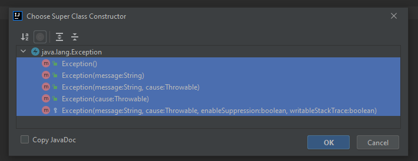
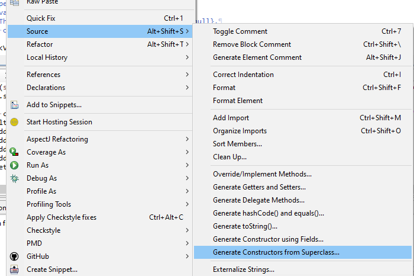
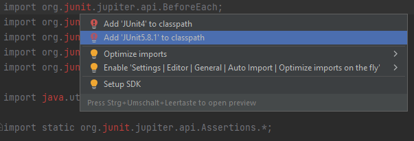
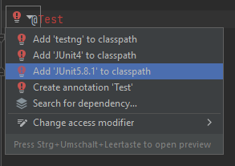

# POSE - PROO - Java Training Assignment
## Exceptions - Generics - Lambdas 
### and a little bit of Collections

## Objective
This assignment is intended for training on Exceptions, Generics, and Lambda Functions
Its content is rather of a technical nature rather than requesting a useful application
to allow focusing on the topics in scope.

## Tasks
### Package at.htlleonding.training.exceptions
Implement two fully featured exception classes that supports all constructors.
- `SomethingWrongException`: An exception that need to be declared by methods throwing that exception.
- `NotANumberException`: An exception that may occur at any time even it is not 
declared as being thrown. In addition, it carries the thing which is supposed 
being a number but is not and provides that value via `getInvalidValue()`.

### Package at.htlleonding.training.lambdas
Declare the following functional interfaces:
- `Trigger`: Does not take or provide any value (no parameter, no return type).
- `ThrowingTrigger`: Same as `Trigger` but capable of throwing an exception of a certain type.
- `Producer`: Takes a value of a certain type and returns a value of a different type.
- `ThrowingProducer`: Same as `Producer` but capable of throwing two exceptions of a certain types.
- `Aggregator`: Combines two values of a certain type and returns the result of the same type.
- `NumberAggregator`: The same as `Aggregator` but limited to `Number`s

### Class `App`
Implement the missing parts as described within the class' source code.
The class shall be instantiated as lazily created singleton!

__Note__ that instances of functional interfaces are (unusually) provided as 
publicly accessible field members by intention.

__Note__ and think of the question regarding overloaded `calc` method.

__Note__ also the little string concatenation benchmark implemented by the
`main` method of the application. Nothing to code their, just execute and observe.

## Unit Tests
All required functionality is backed with unit tests.
All tasks may be considered as achieved, if all tests of all test suites can be run and passed.

See also the 'JUnit5' section in the 'Hints' chapter below.

## Hints
#### Generate all constructors of Exceptions as declared by their super class:
- IntelliJ: 
  - Right click into the body of your class and select 
    'Generate...' -> 'Constructor' in the context menu (or use the suitable shortcut).
  - Select all c'tors of the super class and hit 'OK'.
  
  
- Eclipse:
  - Right click into the body of your class and select
  "Source" -> "Generate Constructors from Superclass ..."  in the context menu (or use the suitable shortcut).
  - Tick all c'tors and hit 'OK'
  

#### Unit Test Framework: JUnit5
Use JUnit5 (Jupiter) for executing unit tests. Further details can be found at 
https://junit.org/junit5/docs/current/user-guide/

__Note:__ IntelliJ IDEA is capable of handling the required libraries, a Gradle or Maven project is NOT required.
If the JUnit5 library is not installed, IDEA (usually) asks whether it should be downloaded 
(an `Alt+Enter` kick on a missing test class import or annotation might be required).

When prompted, be sure to select a JUnit5 library (not JUnit4!) like this one:
 
